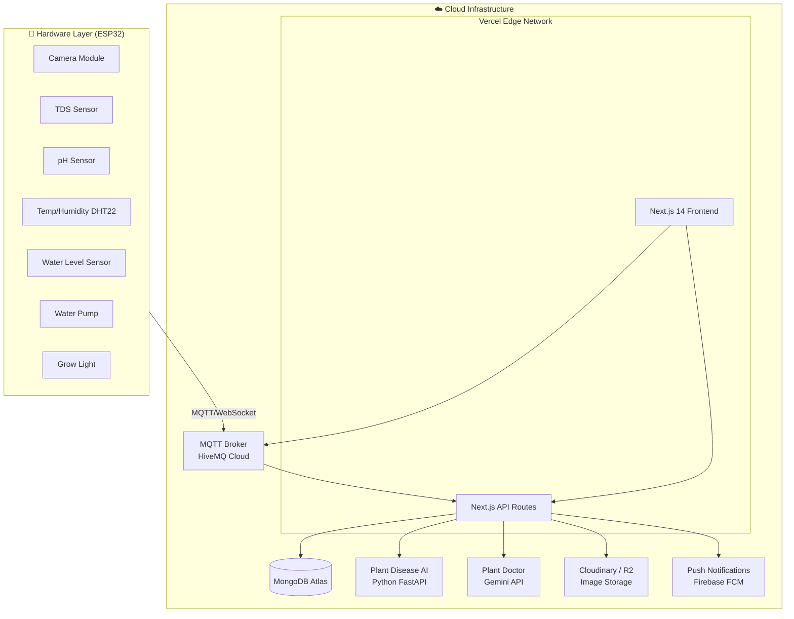

# 🌿 Smart Garden AIoT — Tài Liệu Thiết Kế Dự Án

> **Version:** 1.0 | **Ngày:** 19/03/2026 | **Stack:** Next.js 14 · Vercel · MongoDB Atlas · ESP32

---

## 📋 Tổng Quan Dự Án

**Smart Garden AIoT** là nền tảng thương mại điện tử kết hợp hệ thống IoT thông minh cho cây trồng thủy canh. Khách hàng có thể mua sản phẩm (hạt giống, dinh dưỡng, chậu thông minh) và quản lý chậu cây qua dashboard được tích hợp AI nhận diện bệnh lá và chatbot tư vấn cây trồng.

---

## 🏗️ Kiến Trúc Hệ Thống Tổng Thể



---

## 🗄️ Lựa Chọn Database: MongoDB Atlas ✅

### So Sánh MongoDB Atlas vs Supabase

| Tiêu chí | **MongoDB Atlas** ✅ | Supabase |
|---|---|---|
| **Dữ liệu sensor IoT** | ✅ Lý tưởng — time-series, nested JSON tự nhiên | ⚠️ Cần thiết kế schema cứng |
| **Schema linh hoạt** | ✅ Schemaless, dễ mở rộng sensor mới | ❌ Relational, cần migration |
| **AI/Image metadata** | ✅ Lưu JSON kết quả AI dễ dàng | ⚠️ Cần JSONB column |
| **Vercel Integration** | ✅ Native Mongoose/Prisma adapter | ✅ Supabase JS Client |
| **Free Tier** | ✅ 512MB Shared | ✅ 500MB Database |
| **Real-time** | ✅ Change Streams + Atlas Stream Processing | ✅ Realtime built-in |
| **Time-series** | ✅ Native Time Series Collection | ❌ Không native |
| **Auth tích hợp** | ❌ Cần NextAuth.js | ✅ Built-in Auth |
| **Full-text Search** | ✅ Atlas Search (Lucene) | ✅ pg_tsvector |

> **Kết luận: Chọn MongoDB Atlas** vì dữ liệu sensor IoT có dạng document/JSON tự nhiên, cần schema linh hoạt khi thêm sensor mới, và hỗ trợ Time Series Collection native cho dữ liệu đo lường liên tục. Dùng **NextAuth.js** để xử lý Google OAuth.

---

## 🗺️ Cấu Trúc Website (Sitemap)

```
smart-garden.vercel.app/
│
├── 🏠 /                          # Trang chủ (Landing Page)
├── 🛍️  /products                 # Danh mục sản phẩm
│   ├── /products/seeds            #  └─ Hạt giống thủy canh
│   ├── /products/nutrients        #  └─ Dung dịch dinh dưỡng
│   └── /products/smart-pots       #  └─ Chậu thông minh ESP32
├── 📦 /products/[slug]            # Chi tiết sản phẩm
├── 🛒 /cart                       # Giỏ hàng
├── 💳 /checkout                   # Thanh toán
├── 🔐 /auth/login                 # Đăng nhập Google
├── 🔐 /auth/register              # Đăng ký
│
└── 📊 /dashboard/[deviceId]/      # Dashboard (Protected Route)
    ├── /overview                  #  └─ Tab 1: Tổng quan metrics
    ├── /sensors                   #  └─ Tab 2: Điều khiển sensors
    ├── /ai-lab                    #  └─ Tab 3: AI Lab (lịch sử phân tích)
    ├── /plant-doctor              #  └─ Tab 4: Plant Doctor chatbot
    └── /settings                  #  └─ Tab 5: Cài đặt thiết bị
```

---

## 📄 Chi Tiết Từng Trang

### 1. 🏠 Trang Chủ (`/`)
- **Hero Section**: Video/animation cây thủy canh + headline, CTA "Khám phá ngay"
- **Feature Strip**: 3 điểm mạnh chính (IoT Real-time · AI Diagnosis · Thủy canh dễ dàng)
- **Product Showcase**: Featured products grid với hover animation
- **How It Works**: Timeline 4 bước (Mua → Cắm → Kết nối → Giám sát AI)
- **Testimonials**: Review từ khách hàng thực
- **Newsletter CTA**

### 2. 🛍️ Trang Danh Mục (`/products`)
- Filter sidebar: theo loại, giá, đánh giá
- Sort: mới nhất, giá tăng/giảm, bán chạy
- Product card grid: ảnh, tên, giá, rating
- Category tabs: Seeds | Nutrients | Smart Pots

### 3. 📦 Trang Chi Tiết Sản Phẩm (`/products/[slug]`)
- Ảnh gallery (zoom hover)
- Thông số kỹ thuật (đặc biệt Smart Pot: list sensors)
- Live demo widget (cho Smart Pot): hiển thị demo dashboard
- Reviews & Rating
- Sản phẩm liên quan ("Mua kèm" bundle suggestion)
- CTA: **Thêm vào giỏ** (Orange) + **Mua ngay** (Emerald)

### 4. 🛒 Giỏ Hàng & Thanh Toán (`/cart`, `/checkout`)
- Sidebar cart drawer (slide from right)
- Checkout: địa chỉ → thanh toán (VNPay / Stripe) → xác nhận
- Order summary với upscale suggestions

### 5. 🔐 Auth (`/auth`)
- Google OAuth via NextAuth.js
- Sau khi đăng ký: mặc định vào `/dashboard` nếu có device

---

## 📊 Dashboard — Chi Tiết Các Tab

### Tab 1: Overview (`/dashboard/[id]/overview`)
```
┌─────────────────────────────────────────────────────┐
│  🌿 My Basil Pot  ● Online   [Capture Now] [Settings]│
├──────────┬──────────┬──────────┬────────────────────┤
│ TDS      │ pH       │ Temp     │ Humidity            │
│ 1150 ppm │ 6.2      │ 22.4°C   │ 68%                │
├──────────┴──────────┴──────────┴────────────────────┤
│  📹 Live Camera Feed          📊 Nutrient 24h Chart  │
│  [Camera stream / last photo] [Recharts line chart]  │
├─────────────────────────────────────────────────────┤
│  🔔 Smart Alerts (latest 5 from AI)                  │
│  ⚠️ TDS thấp hơn ngưỡng – Có thể thiếu dinh dưỡng N │
│  ✅ Cây khỏe mạnh – Ảnh lúc 14:30 hôm nay           │
└─────────────────────────────────────────────────────┘
```

### Tab 2: Sensor Control (`/dashboard/[id]/sensors`)
- **Camera Control**: Nút "Chụp ngay" → gửi MQTT command → ESP32 chụp → upload → AI phân tích → hiển thị kết quả
- **Actuator Controls**: Toggle bơm nước, bật/tắt đèn, hẹn giờ tưới
- **Sensor Calibration**: Nhập giá trị hiệu chuẩn pH, TDS
- **Alert Thresholds**: Kéo slider đặt ngưỡng cảnh báo

### Tab 3: AI Lab (`/dashboard/[id]/ai-lab`)
- Grid card lịch sử phân tích ảnh (từ component [AILabPage.tsx](file:///f:/BIGBOSS/GitHub/smart-garden-aiot/src/app/pages/AILabPage.tsx) hiện có)
- Filter: theo ngày, theo loại bệnh
- Card hiển thị: ảnh gốc | ảnh AI annotated | confidence % | diagnosis | suggested action
- **AI Reasoning Panel**: Ví dụ — *"Vàng lá (confidence 89%) + TDS=450ppm thấp + pH=7.1 cao → Nghi ngờ: Thừa kiềm gây thiếu Fe. Đề xuất: Điều chỉnh pH xuống 5.8–6.2, bổ sung chelate sắt"*

### Tab 4: Plant Doctor (`/dashboard/[id]/plant-doctor`)
- **AI Chatbot** (dựa trên [PlantDoctorChat.tsx](file:///f:/BIGBOSS/GitHub/smart-garden-aiot/src/app/components/PlantDoctorChat.tsx) hiện có):
  - Input: text + upload ảnh
  - Gemini API với system prompt chuyên về cây thủy canh
  - Lịch sử chat persist (MongoDB)
- **Hướng dẫn (Guide Tab)**:
  - Bài viết: Bắt đầu thủy canh, Chỉnh pH, Chọn dinh dưỡng...
  - Tìm kiếm nội dung

### Tab 5: Settings (`/dashboard/[id]/settings`)
- Đặt tên thiết bị, ảnh chậu cây
- Cài đặt lịch chụp camera (mỗi X giờ)
- Cài đặt thông báo (Push, Email)
- Quản lý ngưỡng cảnh báo
- Thông tin thiết bị (firmware version, WiFi MAC)

---

## 🤖 Kiến Trúc AI/ML

### Module 1: Plant Disease Detection (Vision AI)

```
Image Input (từ ESP32 Camera / Upload)
        │
        ▼
[Cloudinary / R2 Storage]  ←── Raw image URL
        │
        ▼
[AI Service: Python FastAPI]
  ├── Model: YOLOv8 fine-tuned trên PlantVillage Dataset
  │   (hoặc: Gemini Vision API cho MVP nhanh)
  │
  ├── Output: { disease_type, confidence, bounding_boxes }
  │
  └── Multi-modal Reasoning:
      Kết hợp: { disease_detected, tds_value, ph_value, temp }
      → Rule-based + LLM reasoning → Final Diagnosis + Recommendation
        │
        ▼
[MongoDB] ←── Lưu diagnosis result
        │
        ▼
[Firebase FCM] ←── Gửi Push Notification đến User
```

**Lộ trình AI:**
| Giai đoạn | Approach | Chi phí |
|---|---|---|
| **MVP** | Gemini Vision API (zero training) | ~$0.002/ảnh |
| **Production** | Fine-tune YOLOv8 với PlantVillage Dataset | Server inference |
| **Advanced** | Custom CNN + Multi-sensor fusion model | Self-hosted |

### Module 2: Plant Doctor Chatbot

```
System Prompt (RAG Knowledge Base về thủy canh)
+ User Message + Device Sensor Context (TDS, pH, temp)
+ Conversation History
        │
        ▼
[Gemini 1.5 Flash API]  (chi phí thấp, context dài)
        │
        ▼
Markdown response với:
  - Diagnosis
  - Step-by-step action plan
  - Product recommendations (linking to store)
```

### Multi-Sensor Fusion Logic (Rule Engine)
```javascript
// Ví dụ: Hệ thống reasoning cảnh báo
if (leaf_color === "yellow" && disease === "none" && tds < 600) {
  alert("⚠️ Thiếu dinh dưỡng — TDS quá thấp. Thêm dung dịch A+B")
}
if (leaf_color === "yellow" && ph > 7.0) {
  alert("⚠️ pH quá cao → Rễ không hấp thu được Fe/Mn. Điều chỉnh xuống 5.8–6.2")
}
if (tds > 2000 && leaf_tips === "burnt") {
  alert("🚨 Nồng độ chất dinh dưỡng quá cao — Pha thêm nước")
}
```

---

## 🔌 Phần Cứng IoT (ESP32)

### Bill of Materials (Smart Pot)

| Component | Model | Vai trò |
|---|---|---|
| **MCU** | ESP32-S3 | WiFi/BLE, Camera interface, processing |
| **Camera** | OV2640 2MP | Chụp ảnh phân tích AI |
| **TDS Sensor** | Gravity TDS | Đo tổng chất rắn hòa tan dinh dưỡng |
| **pH Sensor** | Atlas Scientific pH | Đo độ chua dung dịch (analog/I2C) |
| **Temp/Humidity** | DHT22 | Nhiệt độ/độ ẩm không khí |
| **Water Level** | Ultrasonic HC-SR04 | Mực nước bồn dự trữ |
| **Water Pump** | Mini DC 5V | Bơm dinh dưỡng tự động |
| **Grow Light** | LED 20W Full Spectrum | Đèn trồng cây |
| **Relay Module** | 2-Channel Relay | Điều khiển bơm & đèn |

### Giao Thức Truyền Thông

```
ESP32  ←──MQTT──→  HiveMQ Cloud (MQTT Broker)  ←──WebSocket──→  Next.js Backend
  │                                                                       │
  │  Topics:                                                              │
  ├── PUBLISH: garden/{deviceId}/sensors     (sensor data mỗi 30s)      │
  ├── PUBLISH: garden/{deviceId}/camera      (ảnh base64 / URL)         │
  ├── SUBSCRIBE: garden/{deviceId}/commands  (bật/tắt từ dashboard)     │
  └── SUBSCRIBE: garden/{deviceId}/config    (cập nhật cài đặt)         │
```

### Firmware Flow (ESP32 Pseudocode)
```cpp
loop() {
  // 1. Đọc sensors mỗi 30 giây
  sensors.read(); // TDS, pH, temp, humidity, waterLevel
  mqtt.publish("garden/DEVICE_ID/sensors", sensors.toJSON());

  // 2. Chụp ảnh theo lịch (mặc định mỗi 6 giờ)
  if (cameraSchedule.isDue()) {
    image = camera.capture();
    url = uploadToCloudinary(image);
    mqtt.publish("garden/DEVICE_ID/camera", { url });
  }

  // 3. Lắng nghe lệnh từ dashboard
  if (mqtt.receive("garden/DEVICE_ID/commands")) {
    executeCommand(command); // pump_on, light_off, capture_now
  }
}
```

---

## 🏛️ Cấu Trúc Database (MongoDB Atlas)

### Collections

#### `users`
```json
{
  "_id": "ObjectId",
  "name": "Nguyễn Văn A",
  "email": "user@example.com",
  "image": "https://...",
  "provider": "google",
  "role": "customer",
  "createdAt": "ISODate",
  "addresses": [
    {
      "label": "Nhà",
      "street": "123 Lê Lợi",
      "city": "Hồ Chí Minh",
      "isDefault": true
    }
  ]
}
```

#### `devices` (Chậu thông minh)
```json
{
  "_id": "ObjectId",
  "deviceId": "SGP-2024-001",
  "userId": "ObjectId → users",
  "name": "Chậu Húng Quế Phòng Khách",
  "plantType": "Húng quế",
  "firmwareVersion": "1.2.3",
  "wifiMAC": "AA:BB:CC:DD:EE:FF",
  "isOnline": true,
  "lastSeenAt": "ISODate",
  "config": {
    "cameraInterval": 21600,
    "alertThresholds": {
      "tds": { "min": 800, "max": 1800 },
      "ph": { "min": 5.5, "max": 7.0 },
      "temp": { "min": 18, "max": 30 },
      "waterLevel": { "min": 20 }
    },
    "notificationsEnabled": true
  },
  "createdAt": "ISODate"
}
```

#### `sensor_readings` (Time Series Collection)
```json
{
  "metadata": {
    "deviceId": "SGP-2024-001",
    "sensorType": "multi"
  },
  "timestamp": "ISODate",
  "tds": 1150,
  "ph": 6.2,
  "waterTemp": 22.4,
  "airTemp": 24.8,
  "humidity": 68.0,
  "waterLevel": 75
}
```
> ⚡ Dùng **MongoDB Time Series Collection** — tự động partition + compress theo thời gian, truy vấn nhanh hơn 10x so với collection thường.

#### `ai_diagnostics` (Kết quả phân tích AI)
```json
{
  "_id": "ObjectId",
  "deviceId": "SGP-2024-001",
  "userId": "ObjectId",
  "imageUrl": "https://cloudinary.com/...",
  "annotatedImageUrl": "https://...",
  "capturedAt": "ISODate",
  "plantDisease": {
    "detected": true,
    "type": "yellow_leaf",
    "confidence": 0.89,
    "boundingBoxes": []
  },
  "sensorContext": {
    "tds": 450,
    "ph": 7.1,
    "temp": 23.5
  },
  "diagnosis": "Vàng lá do thiếu sắt (Fe) — pH quá cao cản trở hấp thu",
  "recommendation": "Điều chỉnh pH xuống 5.8–6.2, bổ sung chelate sắt",
  "aiModel": "gemini-vision-1.5",
  "notificationSent": true
}
```

#### `products`
```json
{
  "_id": "ObjectId",
  "slug": "hat-giong-rau-muong",
  "name": "Hạt Giống Rau Muống Thủy Canh",
  "category": "seeds",
  "price": 35000,
  "salePrice": 29000,
  "images": ["url1", "url2"],
  "description": "...",
  "specs": { "germination": "3-5 ngày", "harvest": "20-25 ngày" },
  "stock": 500,
  "rating": 4.8,
  "reviewCount": 127,
  "tags": ["rau muống", "thủy canh", "dễ trồng"]
}
```

#### `orders`
```json
{
  "_id": "ObjectId",
  "userId": "ObjectId",
  "orderCode": "SG-20260319-001",
  "items": [
    { "productId": "ObjectId", "name": "...", "qty": 2, "price": 35000 }
  ],
  "totalAmount": 70000,
  "shippingAddress": { "street": "...", "city": "..." },
  "paymentMethod": "vnpay",
  "paymentStatus": "paid",
  "orderStatus": "processing",
  "deviceActivationCode": "SGP-2024-001",
  "createdAt": "ISODate"
}
```

#### `chat_history`
```json
{
  "_id": "ObjectId",
  "deviceId": "SGP-2024-001",
  "userId": "ObjectId",
  "messages": [
    { "role": "user", "content": "Cây bị vàng lá phải làm sao?", "timestamp": "ISODate" },
    { "role": "assistant", "content": "...", "timestamp": "ISODate" }
  ],
  "updatedAt": "ISODate"
}
```

---

## 🎨 Design System

### Bảng Màu (Color Tokens)

| Token | Hex | Sử dụng |
|---|---|---|
| `brand-emerald-main` | `#10B981` | CTA chính, icon, logo, active state |
| `brand-emerald-dark` | `#2E7D32` | Hover/pressed state cho nút xanh |
| `brand-emerald-light` | `#D1FAE5` | Nền nhãn dán, chip "Healthy" |
| `brand-blue-main` | `#0EA5E9` | Link, border IoT widget, nhấn mạnh dữ liệu |
| `brand-blue-light` | `#E0F2FE` | Nền chart khu vực, card biểu đồ |
| `brand-orange-main` | `#F59E0B` | "Mua Ngay", "Thêm giỏ", badge "Sale" |
| `status-danger` | `#EF4444` | Alert khẩn, nút xóa, chấm offline |
| `status-success` | `#22C55E` | Chấm online, chip "Healthy AI result" |
| `text-dark` | `#1E293B` | Văn bản chính |
| `text-muted` | `#64748B` | Caption, text phụ, placeholder |
| `bg-white` | `#FFFFFF` | Nền trang e-commerce |
| `bg-light` | `#F8FAFC` | Nền phân section, dashboard background |

### Typography (Font: Inter)

| Style | Weight | Size | Line Height | Dùng cho |
|---|---|---|---|---|
| `heading-1` | Bold 700 | 32px | 40px | Hero title, page header |
| `heading-2` | Bold 700 | 24px | 32px | Section title, modal title |
| `heading-3` | Semibold 600 | 20px | 28px | Card title, widget header |
| `body-base` | Regular 400 | 16px | 24px | Body text, description |
| `body-semibold` | Semibold 600 | 16px | 24px | Button label, metric value |
| `caption` | Regular 400 | 14px | 20px | Metadata, timestamp, label |
| `caption-bold` | Medium 500 | 14px | 20px | Tag, chip, badge |

### Component Library (dùng lại từ dự án hiện tại)

| Component | File | Sử dụng |
|---|---|---|
| `MetricCardWithSparkline` | [MetricCardWithSparkline.tsx](file:///f:/BIGBOSS/GitHub/smart-garden-aiot/src/app/components/MetricCardWithSparkline.tsx) | Dashboard Overview Tab |
| `NutrientStabilityChart` | [NutrientStabilityChart.tsx](file:///f:/BIGBOSS/GitHub/smart-garden-aiot/src/app/components/NutrientStabilityChart.tsx) | Chart dinh dưỡng 24h |
| `LiveCamFeed` | [LiveCamFeed.tsx](file:///f:/BIGBOSS/GitHub/smart-garden-aiot/src/app/components/LiveCamFeed.tsx) | Camera stream/photo |
| `DiagnosticCard` | [DiagnosticCard.tsx](file:///f:/BIGBOSS/GitHub/smart-garden-aiot/src/app/components/DiagnosticCard.tsx) | AI Lab history grid |
| `PlantDoctorChat` | [PlantDoctorChat.tsx](file:///f:/BIGBOSS/GitHub/smart-garden-aiot/src/app/components/PlantDoctorChat.tsx) | Plant Doctor Tab |
| `ControlCenter` | [ControlCenter.tsx](file:///f:/BIGBOSS/GitHub/smart-garden-aiot/src/app/components/ControlCenter.tsx) | Sensor Control Tab |
| `SmartAlerts` | [SmartAlerts.tsx](file:///f:/BIGBOSS/GitHub/smart-garden-aiot/src/app/components/SmartAlerts.tsx) | Notification panel |
| `AIVisionHub` | [AIVisionHub.tsx](file:///f:/BIGBOSS/GitHub/smart-garden-aiot/src/app/components/AIVisionHub.tsx) | Trigger camera + view AI result |

---

## 🏗️ Cấu Trúc Next.js Project

```
smart-garden-nextjs/
├── app/
│   ├── (marketing)/              # Group: E-commerce public pages
│   │   ├── page.tsx              # Trang chủ
│   │   ├── products/
│   │   │   ├── page.tsx          # Danh mục
│   │   │   └── [slug]/page.tsx   # Chi tiết
│   │   ├── cart/page.tsx
│   │   └── checkout/page.tsx
│   ├── (auth)/
│   │   ├── login/page.tsx
│   │   └── register/page.tsx
│   ├── dashboard/
│   │   └── [deviceId]/
│   │       ├── layout.tsx        # Dashboard shell + sidebar
│   │       ├── overview/page.tsx
│   │       ├── sensors/page.tsx
│   │       ├── ai-lab/page.tsx
│   │       ├── plant-doctor/page.tsx
│   │       └── settings/page.tsx
│   └── api/
│       ├── auth/[...nextauth]/   # NextAuth Google OAuth
│       ├── devices/              # CRUD devices
│       ├── sensors/              # Sensor data ingestion
│       ├── ai/
│       │   ├── diagnose/         # Plant disease AI endpoint
│       │   └── chat/             # Plant Doctor chatbot
│       ├── products/             # Product catalog
│       └── orders/               # Order management
├── components/
│   ├── ui/                       # shadcn/ui components
│   ├── dashboard/                # Dashboard-specific (migrate từ Vite project)
│   └── marketing/                # E-commerce components
├── lib/
│   ├── mongodb.ts                # MongoDB connection
│   ├── mqtt.ts                   # MQTT client
│   └── ai.ts                     # AI service wrapper
├── models/                       # Mongoose schemas
│   ├── User.ts
│   ├── Device.ts
│   ├── SensorReading.ts
│   ├── AIDiagnostic.ts
│   └── Product.ts
└── middleware.ts                  # Auth protection cho /dashboard
```

---

## 🚀 Kế Hoạch Triển Khai (Phases)

### Phase 1 — MVP (4–6 tuần)
- [x] Migrate Vite/React dashboard → Next.js 14
- [ ] E-commerce: Trang chủ + Danh mục + Chi tiết sản phẩm
- [ ] Google OAuth (NextAuth.js) + Đăng ký/Đăng nhập
- [ ] Dashboard: Overview Tab + Sensor charts (mock data)
- [ ] MongoDB Atlas setup + Mongoose models
- [ ] Deploy lên Vercel + cấu hình môi trường

### Phase 2 — IoT Integration (3–4 tuần)
- [ ] ESP32 firmware: đọc sensors + MQTT publish
- [ ] MQTT Broker (HiveMQ Cloud) kết nối với Next.js API
- [ ] Real-time sensor data → dashboard (WebSocket)
- [ ] Camera capture → Cloudinary upload

### Phase 3 — AI Features (3–4 tuần)
- [ ] Plant Disease Detection (Gemini Vision API MVP)
- [ ] Multi-sensor fusion reasoning engine
- [ ] Push notifications (Firebase FCM)
- [ ] Plant Doctor Chatbot (Gemini + RAG)

### Phase 4 — E-commerce Full (2–3 tuần)
- [ ] Giỏ hàng + Thanh toán (VNPay)
- [ ] Order management
- [ ] Device activation sau khi mua Smart Pot

---

## ⚙️ Biến Môi Trường (Environment Variables)

```env
# Database
MONGODB_URI=mongodb+srv://...@cluster.mongodb.net/smart-garden

# Auth
NEXTAUTH_SECRET=your-secret
GOOGLE_CLIENT_ID=...
GOOGLE_CLIENT_SECRET=...

# MQTT
MQTT_BROKER_URL=mqtt://broker.hivemq.cloud
MQTT_USERNAME=...
MQTT_PASSWORD=...

# AI
GEMINI_API_KEY=...
PLANT_DISEASE_API_URL=https://ai-service.railway.app

# Storage
CLOUDINARY_URL=cloudinary://...

# Notifications
FIREBASE_SERVICE_ACCOUNT=...
```

---

## 📊 Tổng Kết Chi Phí (Ước Tính / Tháng)

| Service | Plan | Chi phí |
|---|---|---|
| **Vercel** | Pro (nên dùng cho app commercial) | $20/tháng |
| **MongoDB Atlas** | M10 Shared (512MB free / M10 $57) | Free → $57 |
| **HiveMQ Cloud** | Free (100 connections) | $0 |
| **Gemini API** | Pay-per-use (~1000 ảnh/tháng) | ~$2/tháng |
| **Cloudinary** | Free (25GB) | $0 |
| **Firebase FCM** | Free | $0 |
| **Tổng MVP** | | **~$22–$79/tháng** |

---

*Tài liệu này sẽ được cập nhật theo từng phase của dự án.*
